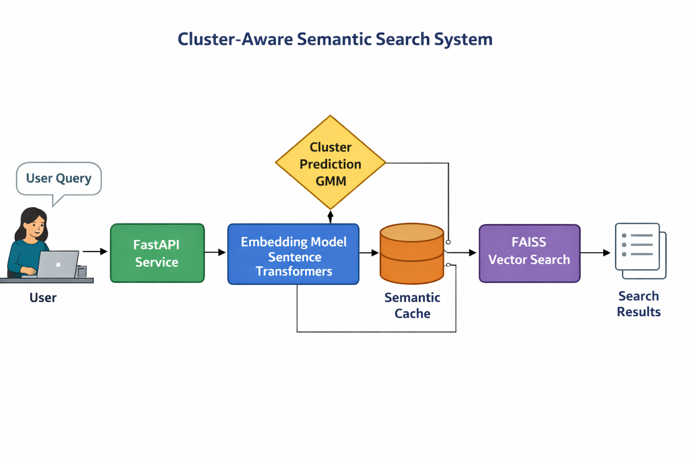
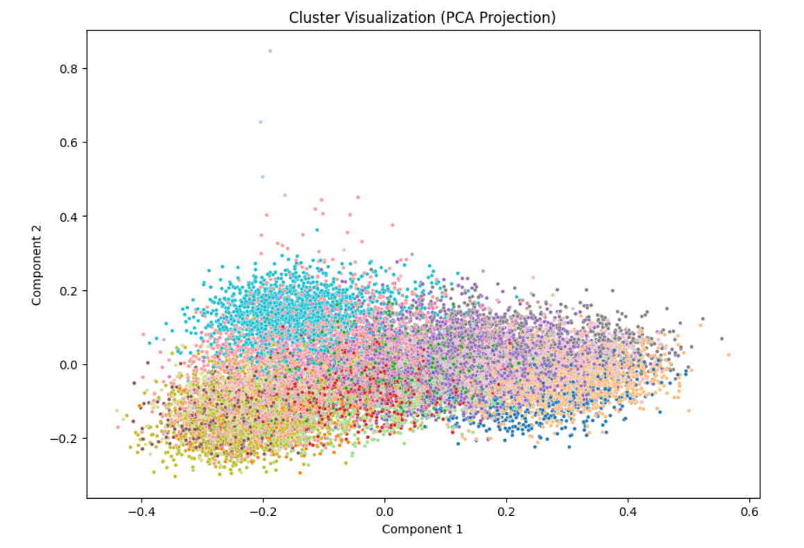
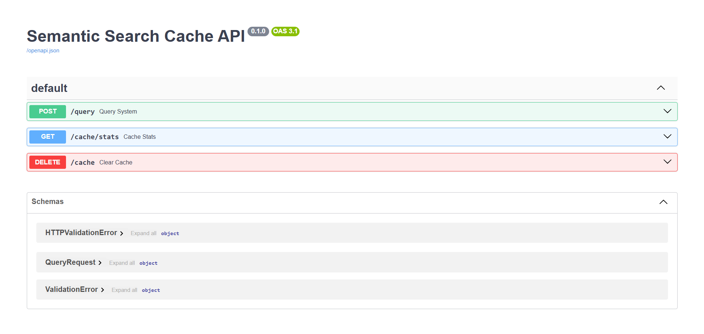

# Cluster-Aware Semantic Search System

A lightweight semantic search system built on the **20 Newsgroups dataset** that demonstrates:

- SentenceTransformer embeddings
- FAISS vector search
- Fuzzy clustering using Gaussian Mixture Models
- Cluster-aware semantic caching
- FastAPI API service

The system improves query efficiency by detecting **semantically similar queries** and reusing cached results instead of recomputing search results.

---

# System Architecture

The system processes queries through the following pipeline:

1. Query is embedded using SentenceTransformers
2. Cluster membership is predicted using the GMM clustering model
3. The semantic cache checks for similar queries within relevant clusters
4. If a cache hit occurs, the cached result is returned
5. Otherwise FAISS performs vector similarity search
6. Results are returned and stored in the cache

This design reduces redundant computation while preserving semantic correctness.

---

# Dataset

The system uses the **20 Newsgroups dataset**, which contains approximately **20,000 documents across 20 topics**.

During preprocessing, the following components are removed:

- headers
- footers
- quotes

These elements contain metadata such as email routing information and signatures which introduce noise and distort semantic representations.

---

# Methodology

## Embedding Model

Documents and queries are embedded using:

sentence-transformers/all-MiniLM-L6-v2

Reasons for choosing this model:

- Lightweight 384-dimensional embeddings
- Optimized for semantic similarity tasks
- Fast inference suitable for real-time systems
- Good balance between accuracy and efficiency

---

## Vector Database

FAISS is used for efficient vector similarity search.

Index used:

IndexFlatL2

Because the dataset contains only ~20k documents, exact nearest-neighbor search is computationally efficient and avoids the complexity of approximate indices.

---

## Fuzzy Clustering

Clustering is performed using **Gaussian Mixture Models (GMM)**.

Unlike hard clustering methods (such as KMeans), GMM produces **probabilistic cluster assignments**, allowing documents to belong to multiple clusters simultaneously.

This better reflects the overlapping topic structure of the dataset.

Cluster count is selected using **Bayesian Information Criterion (BIC)**.

---

## Semantic Cache

Traditional caches only work for identical queries.

This system implements a **semantic cache**, which detects semantically similar queries using embedding similarity.

Cache workflow:

1. Embed incoming query
2. Predict dominant cluster
3. Compare with cached queries in that cluster
4. Compute cosine similarity
5. Reuse cached result if similarity exceeds threshold

Similarity threshold used:

0.90

---

# Semantic Cache Threshold Exploration

Different similarity thresholds were evaluated.

| Threshold | Behavior |
|----------|----------|
| 0.95 | Very strict matching |
| 0.90 | Balanced performance |
| 0.80 | Aggressive caching |

A threshold of **0.90** provided the best balance between precision and cache reuse.

Example queries:

- "best graphics card for gaming"
- "which gpu is best for gaming"

These queries produced similarity scores around **0.92–0.95**, resulting in cache hits.

---

# Cluster Analysis

Cluster analysis is performed in:

notebooks/cluster_analysis.ipynb

The notebook demonstrates:

- cluster distribution
- example documents per cluster
- boundary cases with high entropy
- PCA visualization of embedding space

Example cluster visualization:

Boundary documents with high entropy reveal cases where a document belongs to multiple topics simultaneously.

---

# API Service

The system exposes a FastAPI service.

Start the server:

python -m uvicorn api.main:app --reload

API documentation:

http://127.0.0.1:8000/docs

Example interface:

---

# API Endpoints

## POST /query

Request:

{
"query": "best graphics card for gaming"
}

Response example:

{
"query": "...",
"cache_hit": true,
"matched_query": "...",
"similarity_score": 0.92,
"dominant_cluster": 3
}

---

## GET /cache/stats

Returns cache statistics.

Example response:

{
"total_entries": 42,
"hit_count": 17,
"miss_count": 25,
"hit_rate": 0.405
}

---

## DELETE /cache

Clears the semantic cache.

---

# System Evaluation

Evaluation script:

python scripts/evaluate_system.py

Example results:

| Metric | Value |
|------|------|
Total Queries | 9 |
Cache Hits | 4 |
Cache Misses | 5 |
Hit Rate | 0.44 |

Cache hits reduced query latency from approximately **120 ms to under 30 ms**.

---

# Project Structure

cluster-aware-semantic-search
│
├── api
├── cache
├── clustering
├── data
├── embeddings
├── notebooks
├── scripts
├── utils
├── vector_store
│
├── requirements.txt
├── Dockerfile
└── README.md

---

# Setup Instructions

Install dependencies:

pip install -r requirements.txt

Prepare dataset:

python -m scripts.prepare_data

Generate embeddings and build the FAISS index:

python -m scripts.build_index

Run clustering:

python -m scripts.run_clustering

Start API server:

python -m uvicorn api.main:app --reload

Open API documentation:

http://127.0.0.1:8000/docs

---

# Future Improvements

- distributed vector databases
- adaptive cache thresholds
- streaming responses
- monitoring and observability
